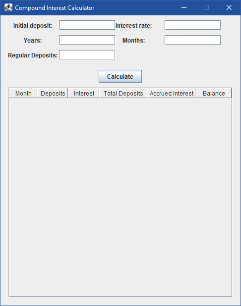
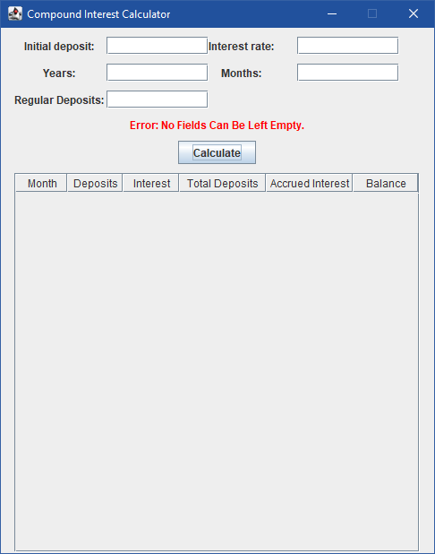
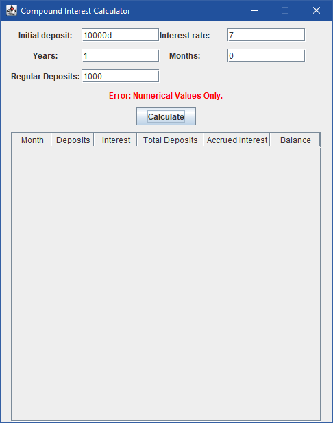
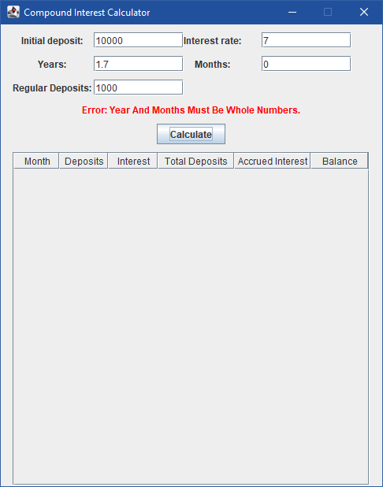
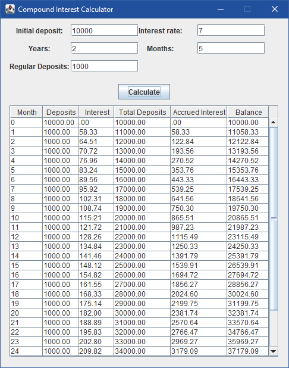

# Computational Creativity

## Project Goal

The goal was to create a user interface for a compound interest calculator which allows user's to easily enter required information such as regular deposits, growth, starting amount and length of time.

## Files I worked on

* main.java
* Compound.java

## Further Work
* Export function that takes the table and column content and exports it to an excel document.

* Include an APY variable (formula: (1 + r/n)^n - 1) where r = Annual interest rate (as decimal) and n = the number of times your product calculates compound interest in a year.

* Include an option to change the compound interval.

* Include an option to change occurence of deposit (monthly deposit to quaterly deposit)

## Program Screenshots

### Main Window

  

### Error Checking

  
  
  

### Main Window

  

