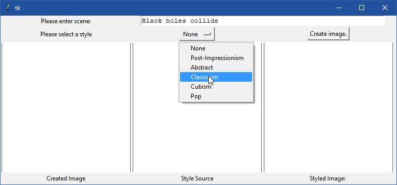

# Computational Creativity

### Project Goal

The goal was to create a user interface for two unrelated systems. One system would create an image based on user input, the second would style that image to a particular genre & later during development I attempted to find a method to categorise said image so that it may be titled.

## Results Of Program

  
  
  
  
  
  
  

## Files I worked on

* main.py
* assist.py
* style.py
* title_generator.py

## Program Screenshots

### Main Window

  

### User Inputs Text Prompt

  

### User Selects Style

  

### Program Generates Output

  

