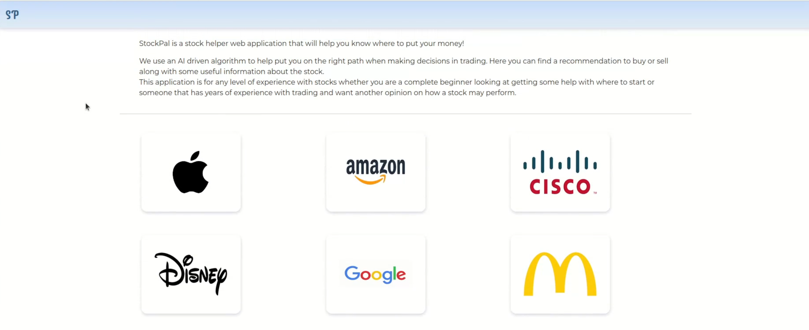
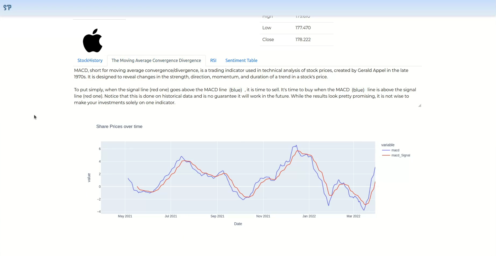
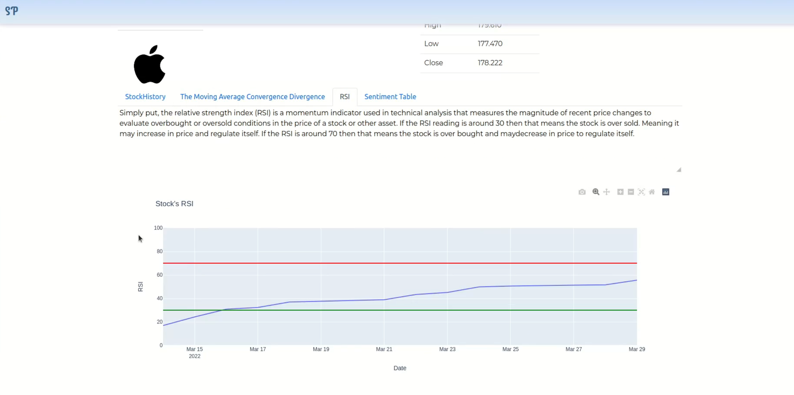
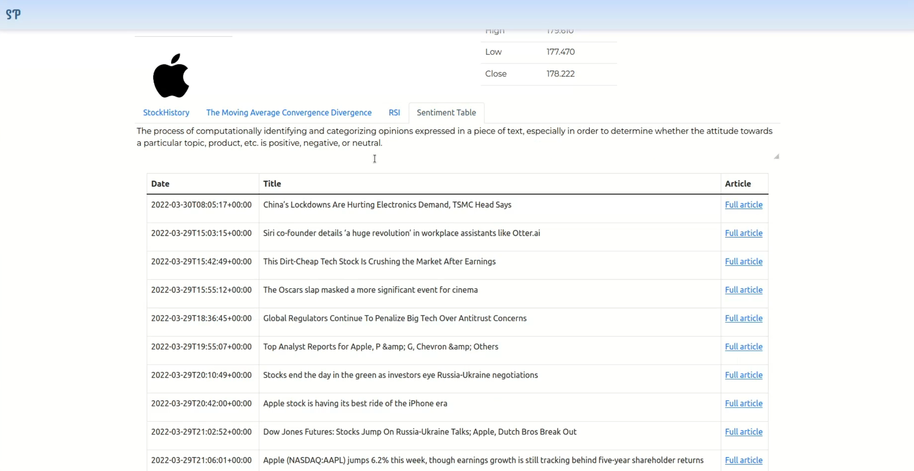
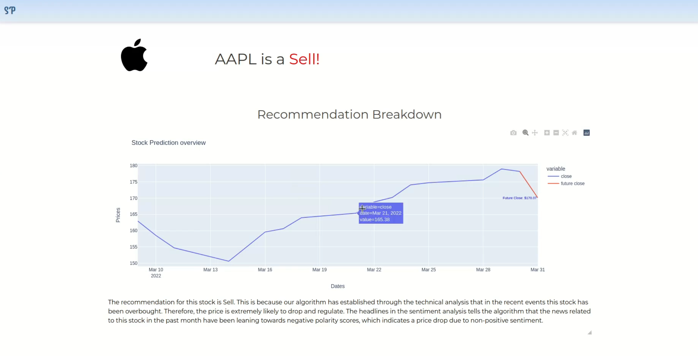

# Group Project

## Project Goal

The goal was to create a web based application capable of providing the user with a buy/hold/sell recommendation for a particular stock. The application needed to be able to provide a reason for its result (based on the different types of analysis).

## Further Work
* To improve the accuracy of recommendation I would increase the number of technical indicators allowing an intricate & full analysis for stocks to be taken and trained thus improving the competency of the recommendation.

* To address the narrow selection of stock choice I would investigate using genetic algorithms to control the values introduced in the neural network training. This would allow our application to self-evaluate against a fitness function and make any stock available for our users.

## Home Page

  

## Stock's Page

  
  
  
  

## Recommendation Page

  

## Notes

### Stock History

The stock history is the value of each share over a certain period. 

### Moving Average Convergence Divergence

The moving average convergence divergence (MACD) is used to display the momentum, strength duration and 
direction of a stock’s price. When the signal line crosses the MACD then the stock should be sold. If however 
the MACD line is above the signal line, then the user should buy.

### Relative Strength Index

The relative strength index measures the momentum the price of a stock is. This means that if trades are 
frequently buying the stock, then the value will be high (around the 70 area), if the stock is in this area, then it 
should be sold. If however the value is being sold (around the 30 area) then the stock should be bought.

### Sentiment Analysis

The sentiment analysis of a stock is the opinion that articles currently have within the past week or so. The 
sentiment is measured through keywords in the title of articles with words/phrases indicating the overall tone 
of the paper. These key words/phrases hold a value and depending on the total value of each keyword 
determines if the article is positive, neutral, or negative.

## Citations
[1] R. Gupta and M. Chen. “Sentiment Analysis for Stock Price Prediction”, 2020. [online] Ieeexplore.ieee.org. 

[2] A. Li. and G. Bastos. “Stock Market Forecasting Using Deep Learning and Technical Analysis: A Systematic Review”, 2020. IEEE Xplore Full-Text PDF: [online] Ieeexplore.ieee.org.

[3] T. Khair, R. Zaki and W. Mahmood. “Stock Price Prediction using Technical, Fundamental and News based Approach”, 2019 [online] Ieeexplore.ieee.org. 

[4] Sentiwordnet Tool link ttps://github.com/aesuli/SentiWordNet

[5] Y. Liu, Z. Su, H. Li and Y. Zhang. “An LSTM based classification method for time series trend Stock Analysis Using AI PAGE 10forecasting”, 2019 [online] ieeexplore.ieee.org/document/8833725

[6] T. Linjordet, and K. Balog. “Impact of Training Dataset Size on Neural Answer Selection Models”,ECIR (1) 2019: 828-835 [online].
